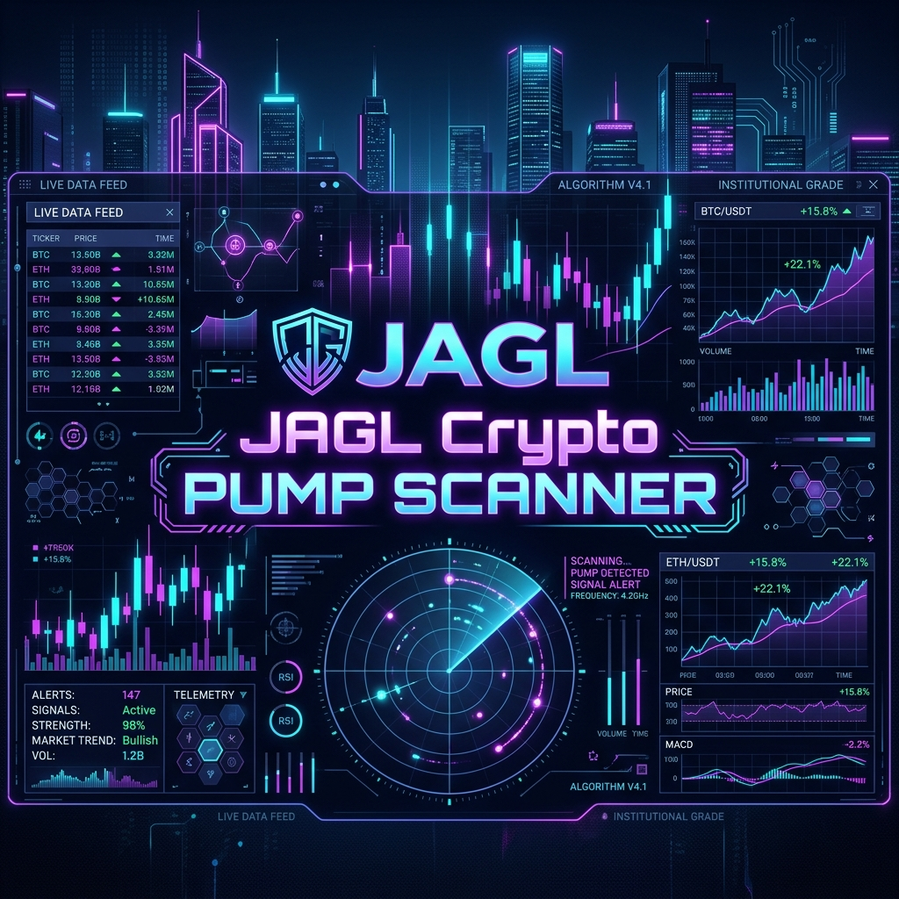
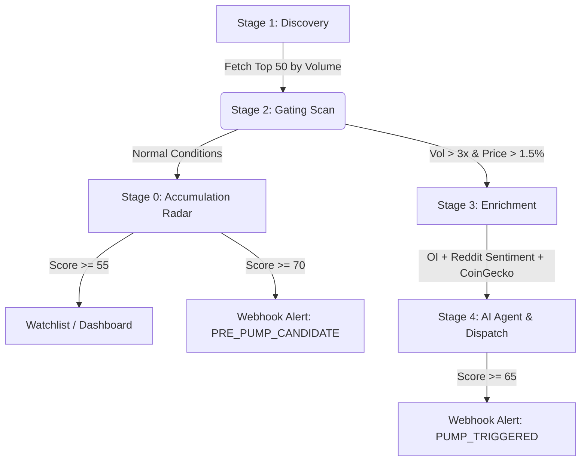
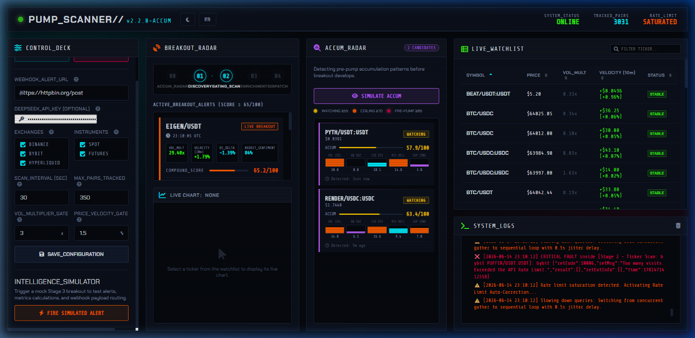
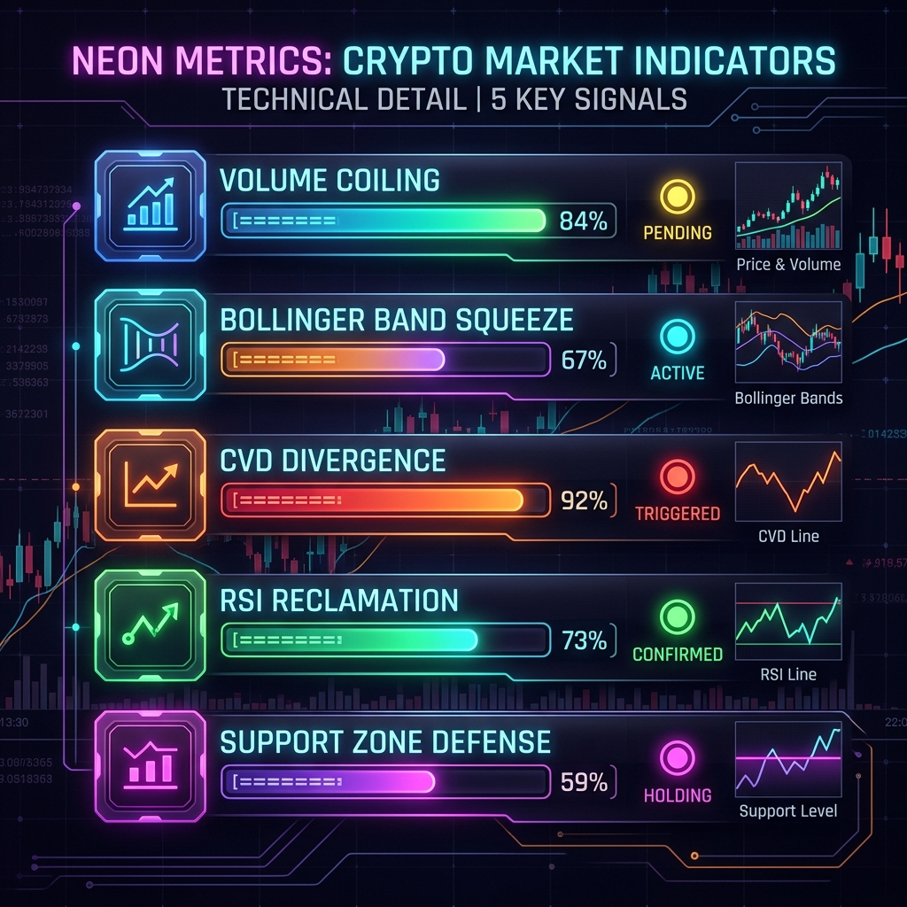

# 🔮 JAGL Crypto PUMP SCANNER — User & Operations Guide



Welcome to the official User & Operations Guide for the **JAGL Crypto PUMP SCANNER (v2.2.0)**. This platform is an institutional-grade, multi-stage detection terminal designed to scan, track, and alert you of cryptocurrency breakout momentum and stealth accumulation patterns in real-time.

---

## 🏗️ System Architecture & Workflow

The scanner operates on a **4-Stage Pipeline** plus an initial **Stage 0 Prediction Engine** that runs concurrently to identify "stealth" smart money activity before price velocity shifts:



---

---

## 🎛️ Section 1: Dashboard Interface Overview

Here is the live interface of your **JAGL Crypto PUMP SCANNER** in action, showing active breakouts, accumulation candidates, and real-time logs:



The interface is divided into four main columns designed for maximum density and low-latency situational awareness.

### 🎚️ Control Deck Panel & Configs

The **Control Deck (Left Column)** contains all operational controls to configure the scanner. Saving settings persists them locally to `state.json`.

*   **START SCANNER / STOP SCANNER**: Toggles the backend CCXT scan loops. When stopped, the scanner ceases querying exchange endpoints.
*   **WEBHOOK_ALERT_URL**: The HTTP POST endpoint where JSON payloads are sent. Compatible with Discord webhooks, Telegram bots, or automation hubs (n8n/Make).
*   **DEEPSEEK_API_KEY**: Optional field. Paste your DeepSeek platform key to enable the Stage 4 AI Agent. Leave blank to bypass AI verification.
*   **EXCHANGES (Checkboxes)**: Select the target exchange feeds. Supports **Binance**, **Bybit**, and **Hyperliquid**.
*   **INSTRUMENTS (Checkboxes)**: Choose between **SPOT** markets or **FUTURES** (Perpetual swaps).
*   **SCAN_INTERVAL (SEC)**: Duration (in seconds) between each scans. Lower intervals yield more responsive data but increase rate-limit consumption.
*   **MAX_PAIRS_TRACKED**: The number of top pairs (sorted by 24h trading volume) to scan. High numbers increase CCXT payload sizes.
*   **VOL_MULTIPLIER_GATE**: The minimum volume spike size (e.g. `3x`) relative to a 49-period average required to trigger a Stage 2 breakout.
*   **PRICE_VELOCITY_GATE**: The minimum price percentage gain (e.g. `1.5%`) over the last two 5-minute candles required to pass Stage 2 gating.
*   **SAVE_CONFIGURATION**: Applies changes and saves them to the backend settings structure.
*   **INTELLIGENCE_SIMULATOR (FIRE SIMULATED ALERT)**: Inject a mock breakout candidate (e.g. BTC) through the pipeline to test webhook routing, sentiment parsing, and frontend rendering.

---

### 📡 Panel Feeds & Indicators

*   **BREAKOUT_RADAR**: Displays a history of active, verified price breakouts. Each card details the calculated Volume Multiplier, Price Velocity, Open Interest Delta, VADER NLP sentiment score, and the final combined AI Compound Score.
*   **ACCUM_RADAR**: Lists Stage 0 accumulation candidates.
    *   `SIMULATE ACCUM`: Injects mock accumulation data to verify UI status indicators.
    *   **Status Badges**:
        *   🟡 `WATCHING` (Score ≥ 55): Low-level accumulation.
        *   🟠 `COILING` (Score ≥ 70): Volatility compression and coiling volume.
        *   🔴 `PRE-PUMP` (Score ≥ 85): Critical zone indicating high likelihood of an imminent pump.
    *   **Signal Bar Charts**: Shows progress bars for the 5 component scores (Volume Coiling, Bollinger Band Squeeze, CVD Divergence, RSI Reclamation, and Support Defense).
*   **LIVE_WATCHLIST**: A real-time matrix of the current top pairs under scan. Clicking any row loads that asset into the interactive **Live Chart** console.
*   **SYSTEM_LOGS**: Real-time logging console that prints connection states, API rate limit auto-throttling diagnostics, and scanner cycle telemetry.

---

## 🔮 Section 2: Stage 0 — Accumulation Radar

The Accumulation Radar operates *before* breakouts occur. It acts as a proactive predictive layer.



### Scoring Engine (0–100)
Assets are classified based on a multi-factor score:
*   🟡 **WATCHING (Score 55–69)**: Initial indicators show buy support building.
*   🟠 **COILING (Score 70–84)**: Energy is compressing; high probability of a breakout.
*   🔴 **PRE-PUMP (Score 85+)**: Volatility compression and buy volume indicators are critical.

### The 5 Core Technical Signals

1.  **Volume Coiling (Max 30 pts)**: Detects stealth accumulation by analyzing volume step-ups across 4 rolling windows of 5 candles.
2.  **Bollinger Band Squeeze (Max 25 pts)**: Measures current bandwidth compression against a 50-period average. Compressions <40% indicate coiling energy.
3.  **CVD Divergence (Max 20 pts)**: Calculates Cumulative Volume Delta to find hidden buy aggression (buying into flat or slightly declining prices).
4.  **RSI Reclamation (Max 15 pts)**: Identifies momentum rising out of oversold territory (RSI 28–60) across consecutive candles.
5.  **Support Zone Defense (Max 10 pts)**: Tracks repeated bounces off a tight support floor (within a 0.3% tolerance band).

---

## 🚨 Section 3: Stage 2 & 3 — Breakout Radar

Once an asset breaks out, the **Gating Scan** triggers immediately:

*   **Volume Multiplier Gate**: Filters out low-volume anomalies by requiring the current 5-minute volume to be at least **3.0x** the 49-period average.
*   **Price Velocity Gate**: Requires price velocity of at least **+1.5%** over the last 2 candles.

When both gates are cleared, the asset is passed to **Stage 3 (Enrichment)**:
*   **Open Interest (OI) Delta**: Analyzes perpetual swap position sizing to determine if the move is fueled by organic leverage.
*   **Social Sentiment**: Scrapes and analyzes Reddit sentiment using VADER NLP models.

---

## 🔗 Section 4: Webhook & Alert Integration

The platform automatically dispatches JSON payloads to your custom webhook URL.

### 1. Pre-Pump Candidate (Stage 0)
Fires when an asset's accumulation score reaches the configured `accum_alert_threshold` (default 70).
```json
{
  "timestamp": "2026-06-14T20:00:00Z",
  "exchange": "hyperliquid",
  "ticker": "SOL/USDC:USDC",
  "status": "PRE_PUMP_CANDIDATE",
  "accum_status": "COILING",
  "accum_score": 74.5,
  "price": 142.35,
  "signals": {
    "volume_coiling": 22.5,
    "bb_squeeze": 19.8,
    "cvd_divergence": 15.2,
    "rsi_reclamation": 12.0,
    "support_zone": 5.0
  }
}
```

### 2. Confirmed Breakout Alert (Stage 3/4)
Fires when a pump is confirmed by technical volume and compound scoring.
```json
{
  "timestamp": "2026-06-14T20:05:00Z",
  "exchange": "binance",
  "ticker": "SOL/USDT",
  "status": "PUMP_TRIGGERED",
  "metrics": {
    "volume_multiplier": 4.5,
    "price_change_2vec": 2.1,
    "open_interest_delta_pct": 12.4,
    "vader_sentiment_score": 0.82,
    "compound_score": 78.5
  }
}
```

---

## 🛠️ Section 5: Troubleshooting & Support

*   **Critical Fault Messages in Logs**: Usually caused by exchange API rate-limiting (HTTP 429). The scanner automatically enters sequential slow-down mode to protect your connections.
*   **Websocket Disconnections**: The dashboard UI automatically reconnects within 3 seconds of a websocket drops.
*   **DeepSeek Failures**: Double-check that your API key is correctly entered in the Control Deck config form.
